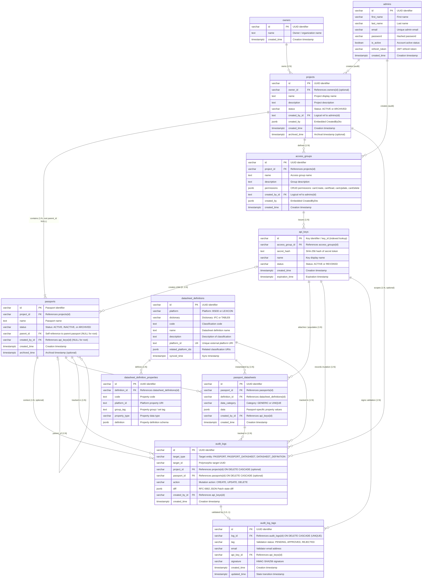

# Data Model

This document outlines the target data model for the **OpenCirc Passport Manager** application (Construction Materials Passport Generator and Manager), updated to support multi-project isolation, direct project passport ownership, granular API access delegation, and normalized global datasheet definitions (PR #59).

---

## Architectural Hierarchy Overview

The target architecture establishes a strict separation of concerns between administrative infrastructure governance, global reference standards, and machine-driven domain operations:

```
admins -> (1:N) -> projects ───────► (1:N) -> passports (root has parent_id IS NULL)
owners -> (1:N) ───┘    │                         │ (1:N)
                        └──► (1:N) -> access groups -> (1:N) -> API Keys
                                                                  │ (CRUD)
                                                                  ▼
                                                      passports, passport_datasheets
                                                                  │
                                                        mutations & diffs
                                                                  ▼
                                                              audit_logs ◄── datasheet_definitions
                                                                  │ (1:0..1)
                                                                  ▼
                                                            audit_log_tags (signed validation)

datasheet_definitions (Global Catalog: bsDD, Lexicon)
         │ (1:N)
         ├─► datasheet_definition_properties (Property Schemas)
         │ (1:N)
         ▼
passport_datasheets (Per-Passport Instance Values) ◄── passports (1:N)
```

### Key Principles
1. **Administrative Boundary & Role Elimination**: Human users exist exclusively as system administrators in the `admins` table (renamed from `users`). The `role` column is eliminated because all human accounts possess identical administrative privileges. Administrators **never** interact with passports, datasheets, or statuses; their sole responsibility is managing `owners`, `projects`, and `access_groups`, and issuing `api_keys`.
2. **Owner Organizations**: Projects can be associated with an `owner` (`owners` table, 1:N). Owners represent client organizations or entities identified simply by `id`, `name`, and `created_time`. The association is optional (`projects.owner_id` is nullable). Deleting an owner disassociates its projects by setting their owner reference to null (`ON DELETE SET NULL`), preserving the project assets, passport hierarchies, and access configurations.
3. **Direct Project Ownership & Partial Unique Root (Proposal 1)**: `passports` directly stores `project_id` referencing `projects(id)` (`ON DELETE CASCADE`). Root passports are identified by `parent_id IS NULL`. The 1:1 invariant between a project and its root passport is enforced via a partial unique index:
   ```sql
   CREATE UNIQUE INDEX uq_project_root_passport 
   ON passports (project_id) 
   WHERE parent_id IS NULL;
   ```
   This completely removes `projects.root_passport_id`, avoids circular foreign key dependencies, and guarantees $O(1)$ project authorization and fast indexed filtering (`WHERE project_id = ?`) without recursive hierarchy traversal.
4. **Atomic Root Provisioning (Solution 3)**: Each project and its single root passport are provisioned **atomically** within the same database transaction (`POST /api/projects`). The root passport is instantiated with `parent_id = NULL`, `project_id = project.id`, and `created_by_id = NULL` (system/administrative provisioning anchor). This eliminates the asynchronous bootstrap API key ceremony, prevents race conditions or partially provisioned projects, and guarantees that every project immediately satisfies the 1:1 root passport invariant upon creation.
5. **Third-Party Machine Operations**: All child passport creation (`parent_id IS NOT NULL`), property mutations, status updates, and datasheet attachments/value population (`passport_datasheets`) are performed exclusively by external 3rd-party applications authenticated via machine `api_keys`.
6. **Access Delegation via Access Groups**: Each project defines one or more `access_groups` (`1:N`). An access group configures CRUD permissions (`permissions` JSONB) defining allowed operations on passports and datasheets within that project.
7. **High-Performance API Keys with Soft Deletion (Solutions 4 & 5)**: Machine credentials (`api_keys`) belong directly to an `access_group` (`1:N`). API keys use a structured prefix format `opc_live_<key_id>_<secret>` where `key_id` enables instantaneous $O(1)$ indexed lookup and `secret_hash` is verified via constant-time SHA-256 (<0.05ms execution, eliminating CPU saturation under high ingestion loads). API keys carry an operational status (`status = 'ACTIVE'` or `'REVOKED'`). Key rotation and decommissioning rely on soft revocation (`status = 'REVOKED'`), instantly halting authorization while preserving historical provenance. Relational foreign keys referencing `api_keys(id)` use `ON DELETE SET NULL` (or cascade alongside project deletion), eliminating database-level `ON DELETE RESTRICT` deadlocks.
8. **Normalized Global Datasheet Definitions (PR #59)**: External data dictionary classifications (bSDD, Lexicon) are decoupled from individual projects and stored in a shared global catalog (`datasheet_definitions` and `datasheet_definition_properties`), uniquely keyed by classification URI (`platform_id`). Passports attach classifications via per-passport instance records (`passport_datasheets`) containing passport-specific property values (`data` JSONB) and machine attribution (`created_by_id -> api_keys.id`). This eliminates combinatorial data duplication across passports, prevents cross-project deletion deadlocks, and accelerates ingestion via local definition caching without redundant external platform API calls.
9. **Machine-Attributed Operational Records**: Operational records (`passport_datasheets`, `audit_logs`, and child `passports`) are authored exclusively by API keys (`created_by_id` referencing `api_keys(id)`). Redundant user snapshots (`CreatedByDto`) are omitted on operational entities in favor of direct relational API key linkage. Global reference catalogs (`datasheet_definitions`) are immutable system caches and carry no creator or project foreign keys.
10. **Dual-Layer Lifecycle Protection & Soft Archiving**: To protect permanent circular economy records (e.g., EU Digital Product Passport mandates with 30–100 year lifespans) against catastrophic accidental destruction, production services enforce **soft archiving** on `projects` and `passports` (`status = 'ARCHIVED'`, accompanied by `archived_time`). API endpoints exclude archived entities by default, while allowing administrative auditing or unarchiving via explicit filters. Database-level `ON DELETE CASCADE` constraints are retained strictly to allow clean, zero-overhead automated teardowns in staging, development, and integration testing environments.
11. **Multi-Entity Audit Logging & RFC 6902 JSON Patch Diffs**: Auditing is refactored from passport-only logging into a unified `audit_logs` subsystem tracking `passports`, `passport_datasheets`, and global `datasheet_definitions` via polymorphic target references (`target_type`, `target_id`). Each log entry stores the exact state delta formatted as an array of RFC 6902 JSON Patch operations (`[{"op": "replace", "path": "...", "value": ...}]`), enabling compact, standardized, and reversible state tracking. Hierarchical scoping (`project_id`, `passport_id`) is denormalized directly onto `audit_logs` to enable $O(1)$ indexed project-wide and passport-wide audit trail queries without multi-table joins.
12. **Tamper-Evident Validation & State Signatures**: It is possible to approve or validate a specific entity state by attaching a validation tag to an `audit_log` entry in the `audit_log_tags` table. Validation follows a single active state transition model (`PENDING`, `APPROVED`, `REJECTED`) and records the validator's `email`, authenticated `api_key_id`, and an HMAC-SHA256 cryptographic signature computed over the canonical payload (`log_id:target_id:email:tag:sha256(diff)`). Any post-hoc tampering with the entity diff, validator identity, or approval status invalidates the cryptographic signature.

---

## Mermaid Entity-Relationship Diagram



---

## Entity Catalog

### 1. `admins`
Represents human system administrators responsible for infrastructure management (projects, access groups, API keys).
- **Table Name**: `admins` (renamed from `users`)
- **JPA Entity**: `com.opencirc.api.passport.model.Admin`
- **Primary Key**: `id` (`VARCHAR(100)`, generated UUID)
- **Key Fields**:
  - `email`: Unique email address used for administrative login.
  - `password`: Hashed password (write-only serialization).
  - `first_name` & `last_name`: Administrator identity details.
  - `is_active`: Account enabled flag.
  - `refresh_token`: Active JWT refresh token.
  - `created_time`: Account creation timestamp.
  *(Note: The `role` column is eliminated. All records in this table are administrators with full management authority over projects and access groups. Admins never manage passports, datasheets, or statuses).*

### 2. `owners`
Represents an owner entity, company, or client organization that owns one or more projects. Intentionally kept minimal.
- **Table Name**: `owners`
- **Primary Key**: `id` (`VARCHAR(100)`, generated UUID)
- **Relationships**:
  - `projects`: One-to-Many relationship to `projects` via `projects.owner_id`.
- **Key Fields**:
  - `name`: Name of the owner organization or client entity.
  - `created_time`: Timestamp of owner creation.

### 3. `projects`
Represents an administrative project workspace encapsulating passport trees and API access groups.
- **Table Name**: `projects`
- **Primary Key**: `id` (`VARCHAR(100)`, generated UUID)
- **Foreign Keys**:
  - `owner_id` -> `owners(id)` (`ON DELETE SET NULL`, optional assignment).
  - `created_by_id` -> `admins(id)` (Logical reference for administrative creator audit).
- **Relationships**:
  - `passports`: One-to-Many relationship to `passports` via `passports.project_id` (`ON DELETE CASCADE` in DDL; soft-archived in production). Exactly one root passport per project has `parent_id IS NULL`, enforced by unique index.
  - `accessGroups`: One-to-Many relationship to `access_groups` (`ON DELETE CASCADE`).
- **Atomic Provisioning (Solution 3)**:
  When a project is created (`POST /api/projects`), the application service atomically provisions both the `projects` row and its single root `passports` record (`parent_id = NULL`, `project_id = project.id`, `created_by_id = NULL`) in the same database transaction. This eliminates synthetic credential bootstrapping ceremonies, avoids race conditions, and guarantees that no project ever exists without its root passport.
- **Dual-Layer Deletion & Production Soft Archiving**:
  To prevent catastrophic data loss of 30–100 year material histories, administrative deletion (`DELETE /api/projects/{id}`) in production services performs **soft archiving**:
  - Sets `projects.status = 'ARCHIVED'` and records `projects.archived_time = NOW()`.
  - Cascades soft archiving to child passports: `UPDATE passports SET status = 'ARCHIVED', archived_time = NOW() WHERE project_id = ?`.
  - API endpoints exclude archived projects and passports by default (`WHERE status != 'ARCHIVED'`), with optional query parameters (`?include_archived=true`) for historical audit trails or restoration.
  - Physical DDL `ON DELETE CASCADE` constraints are retained strictly to allow clean, instant database teardowns in automated testing, development, and CI environments.
- **Key Fields**:
  - `name`: Human-readable name of the project.
  - `description`: Optional textual summary of the project scope.
  - `status`: Operational lifecycle status (`ACTIVE` or `ARCHIVED`).
  - `created_by`: Embedded snapshot (`CreatedByDto`) captured at project creation time.
  - `created_time`: Timestamp of project creation.
  - `archived_time`: Optional timestamp recording when the project was archived.

### 4. `access_groups`
Defines an authorization profile and CRUD permission boundary within a project.
- **Table Name**: `access_groups`
- **Primary Key**: `id` (`VARCHAR(100)`, generated UUID)
- **Foreign Keys**:
  - `project_id` -> `projects(id)` (`ON DELETE CASCADE`)
  - `created_by_id` -> `admins(id)` (Logical reference for creator audit).
- **Key Fields**:
  - `name`: Display label for the group (e.g., `"BIM Importer"`, `"Read-Only Auditor"`).
  - `description`: Purpose and scope description.
  - `permissions`: Structured JSONB defining CRUD permissions against passports and related resources.
  - `created_by`: Embedded snapshot (`CreatedByDto`).
  - `created_time`: Timestamp of creation.

### 5. `api_keys`
High-performance machine authentication credentials issued to an access group for automated API access by 3rd-party applications.
- **Table Name**: `api_keys`
- **JPA Entity**: `com.opencirc.api.passport.model.ApiKey`
- **Primary Key**: `id` (`VARCHAR(100)`, public `key_id` used for $O(1)$ indexed lookup)
- **Foreign Keys**:
  - `access_group_id` -> `access_groups(id)` (`ON DELETE CASCADE`)
- **Key Fields**:
  - `id`: Unique key identifier / public prefix extracted from the API token for instant indexed lookup.
  - `secret_hash`: Cryptographic SHA-256 hash of the secret component. Eliminates CPU-saturating BCrypt hashing on hot paths.
  - `name`: Descriptive key identifier.
  - `status`: Operational status (`ACTIVE` or `REVOKED`). Revoking an API key immediately halts request authorization while preserving referential audit history for dependent records.
  - `expiration_time`: Optional timestamp after which requests using the key are rejected.
  - `created_time`: Key generation timestamp.
- **Token Format & Authentication Flow (Solution 5)**:
  - **Token Structure**: `opc_live_<key_id>_<secret>` (e.g., `opc_live_k8f9a2b1_c7e3f...`).
  - **Indexed Resolution ($O(1)$)**: When an API request arrives with a bearer token, the filter parses `<key_id>` and performs an instantaneous indexed database lookup (`SELECT * FROM api_keys WHERE id = ?`).
  - **Constant-Time Verification**: The server verifies that `status == 'ACTIVE'` and computes `SHA256(secret)`, comparing it against `secret_hash` using constant-time equality.
  - **Performance Optimization**: Verification executes in under 0.05ms (a 1000x throughput boost compared to BCrypt's 50–100ms latency), preventing CPU core starvation during high-frequency data ingestion (such as automated BIM exports or IoT site scanners).
- **Lifecycle & Deletion Strategy**:
  Key rotation relies on soft revocation (`status = 'REVOKED'`). Downstream foreign key constraints use `ON DELETE SET NULL` to avoid database-level `ON DELETE RESTRICT` deadlocks when projects are decommissioned.

### 6. `passports`
Represents circular material passports organized in component/assembly hierarchies.
- **Table Name**: `passports`
- **JPA Entity**: `com.opencirc.api.passport.model.Passport`
- **Primary Key**: `id` (`VARCHAR(100)`)
- **Foreign Keys**:
  - `project_id` -> `projects(id)` (`ON DELETE CASCADE` in DDL; soft-archived in production, direct project anchor).
  - `parent_id` -> `passports(id)` (`ON DELETE CASCADE` in DDL; soft-archived in production, self-referential; NULL for root passports).
  - `created_by_id` -> `api_keys(id)` (`ON DELETE SET NULL`, identifying creating machine credential; NULL for root passports).
- **Constraints & Indexes**:
  - `uq_project_root_passport`: Unique partial index on `(project_id) WHERE parent_id IS NULL`. Enforces exactly one root passport per project.
  - Index on `project_id`: Enables instantaneous $O(1)$ project filtering, listing, and permission verification without recursive tree traversal.
  - `idx_passports_active`: Index on `(project_id, status)` supporting rapid querying of active components (`WHERE status = 'ACTIVE'`).
- **Relationships**:
  - `parent_id`: Self-referential identifier pointing to parent `passports(id)`.
  - `datasheets`: One-to-Many mapping to `passport_datasheets` (`ON DELETE CASCADE`).
  - `auditLogs`: One-to-Many mapping to `audit_logs` (optional passport context, `ON DELETE CASCADE`).
- **Key Fields**:
  - `name`: Display name of the passport.
  - `status`: Passport lifecycle and archiving status (`ACTIVE`, `INACTIVE`, or `ARCHIVED`):
    - `ACTIVE`: Component is active and currently installed in the building assembly.
    - `INACTIVE`: Component has been uninstalled, decommissioned, or staged for reuse/recycling.
    - `ARCHIVED`: Passport record is soft-deleted/archived (preserves full historical record while hiding it from active default queries).
  - `created_time`: Passport creation timestamp.
  - `archived_time`: Optional timestamp recording when the passport was archived.
  *(Note: Root passports are provisioned atomically with the project and have `created_by_id = NULL`. Child passports are created exclusively by 3rd-party applications via API keys; JSON snapshot omitted).*

### 7. `datasheet_definitions`
Shared global catalog storing external classification definitions (bsDD, buildingSMART Lexicon) cached across all projects.
- **Table Name**: `datasheet_definitions`
- **JPA Entity**: `com.opencirc.api.passport.model.DatasheetDefinition`
- **Primary Key**: `id` (`VARCHAR(100)`, generated UUID)
- **Constraints & Indexes**:
  - `uq_datasheet_definitions_platform_id`: Unique constraint on `platform_id` (external classification URI).
  - `idx_datasheet_definitions_code`: Index on `code`.
  - `idx_datasheet_definitions_dictionary`: Index on `dictionary`.
- **Relationships**:
  - `properties`: One-to-Many relationship to `datasheet_definition_properties` via `definition_id` (`ON DELETE CASCADE`).
  - `instances`: One-to-Many relationship to `passport_datasheets` via `definition_id` (`ON DELETE RESTRICT`).
- **Key Fields**:
  - `platform`: Provider origin (`BSDD`, `LEXICON`).
  - `dictionary`: Dictionary classification standard (`IFC`, `TABLE6`, etc.).
  - `code`: Standardized classification code (e.g. `IfcWall`).
  - `name`: Display name of the classification.
  - `description`: Textual summary.
  - `platform_id`: Unique URI identifying the classification in the external platform.
  - `related_platform_ids`: JSONB array of related URIs (e.g., related IFC classes).
  - `synced_time`: Timestamp of synchronization.
  *(Note: Immutable shared global catalog; contains no project or creator foreign keys).*

### 8. `datasheet_definition_properties`
Standardized property schema definitions belonging to a global datasheet definition.
- **Table Name**: `datasheet_definition_properties`
- **JPA Entity**: `com.opencirc.api.passport.model.DatasheetDefinitionProperty`
- **Primary Key**: `id` (`VARCHAR(100)`, generated UUID)
- **Foreign Keys**:
  - `definition_id` -> `datasheet_definitions(id)` (`ON DELETE CASCADE`)
- **Constraints & Indexes**:
  - `uq_definition_property_code`: Unique constraint on `(definition_id, code)`.
  - `idx_definition_property_definition_id`: Index on `definition_id`.
  - `idx_definition_property_code`: Index on `code`.
- **Key Fields**:
  - `code`: Standard property code identifier.
  - `platform_id`: External platform property URI.
  - `group_tag`: Property set / group label (e.g. `Pset_WallCommon`).
  - `property_type`: Data type specifier (e.g. `IfcBoolean`, `IfcLengthMeasure`).
  - `definition`: JSONB schema detailing property metadata, units, and constraints.

### 9. `passport_datasheets`
Per-passport datasheet instance linking a passport to a global definition and storing passport-specific property values. Replaces the legacy `datasheets` and `passport_datasheet_mappings` tables.
- **Table Name**: `passport_datasheets`
- **JPA Entity**: `com.opencirc.api.passport.model.Datasheet` (mapped to `@Table(name = "passport_datasheets")`)
- **Primary Key**: `id` (`VARCHAR(100)`, generated UUID)
- **Foreign Keys**:
  - `passport_id` -> `passports(id)` (`ON DELETE CASCADE`)
  - `definition_id` -> `datasheet_definitions(id)` (`ON DELETE RESTRICT`)
  - `created_by_id` -> `api_keys(id)` (`ON DELETE SET NULL`, identifying the machine credential that attached/populated the datasheet).
- **Constraints & Indexes**:
  - `uq_passport_datasheet`: Unique constraint on `(passport_id, definition_id)` (prevents attaching duplicate definitions to the same passport).
  - `idx_passport_datasheets_passport_id`: Index on `passport_id`.
  - `idx_passport_datasheets_definition_id`: Index on `definition_id`.
- **Key Fields**:
  - `data_category`: `GENERIC` (template level) or `UNIQUE` (instance level).
  - `data`: Complete JSONB payload of passport-specific property values.
  - `created_time`: Timestamp of creation / attachment.
  *(Note: Created and populated exclusively by machine integrations via API keys; JSON snapshot omitted).*

### 10. `audit_logs`
Unified audit log recording polymorphic mutation events and RFC 6902 JSON Patch state diffs across passports, datasheet instances, and global definitions.
- **Table Name**: `audit_logs` (refactored from `passport_logs`)
- **JPA Entity**: `com.opencirc.api.passport.model.AuditLog`
- **Primary Key**: `id` (`VARCHAR(100)`, generated UUID)
- **Foreign Keys**:
  - `project_id` -> `projects(id)` (`ON DELETE CASCADE`, optional tenant context).
  - `passport_id` -> `passports(id)` (`ON DELETE CASCADE`, optional passport context).
  - `created_by_id` -> `api_keys(id)` (`ON DELETE SET NULL`, identifying the API key executing the mutation).
- **Relationships**:
  - `validationTag`: One-to-One optional mapping to `audit_log_tags` (`ON DELETE CASCADE`).
- **Constraints & Indexes**:
  - `idx_audit_logs_target`: Composite index on `(target_type, target_id, created_time ASC)` for instant entity-level audit history.
  - `idx_audit_logs_project`: Composite index on `(project_id, created_time DESC)` for zero-join project-wide activity streams.
  - `idx_audit_logs_passport`: Composite index on `(passport_id, created_time DESC)` for zero-join passport-wide activity streams.
- **Key Fields**:
  - `target_type`: Polymorphic target discriminator (`PASSPORT`, `PASSPORT_DATASHEET`, `DATASHEET_DEFINITION`).
  - `target_id`: ID of the mutated entity.
  - `action`: Mutation action (`CREATE`, `UPDATE`, `DELETE`).
  - `diff`: JSONB payload containing an array of RFC 6902 JSON Patch operations capturing the exact delta from previous to new state:
    ```json
    [
      { "op": "replace", "path": "/data/properties/thickness", "value": 150 },
      { "op": "add", "path": "/data/properties/fireRating", "value": "EI30" }
    ]
    ```
  - `created_time`: Timestamp when the mutation was recorded.
  *(Note: Created exclusively by machine integrations via API keys; JSON snapshot omitted).*

### 11. `audit_log_tags`
Signed validation and approval records attesting to an entity's state at a specific audit log milestone.
- **Table Name**: `audit_log_tags`
- **JPA Entity**: `com.opencirc.api.passport.model.AuditLogTag`
- **Primary Key**: `id` (`VARCHAR(100)`, generated UUID)
- **Foreign Keys**:
  - `log_id` -> `audit_logs(id)` (`ON DELETE CASCADE`, strictly unique).
  - `api_key_id` -> `api_keys(id)` (`ON DELETE RESTRICT`, identifying the machine credential providing the signature).
- **Constraints & Indexes**:
  - `uq_audit_log_tags_log_id`: Unique constraint on `log_id` enforcing a single active validation state per log entry.
  - `idx_audit_log_tags_email`: Index on `email` for querying approvals authored by specific auditors.
  - `idx_audit_log_tags_tag`: Index on `tag` for filtering approved vs rejected states.
- **Key Fields**:
  - `tag`: Validation status enum (`PENDING`, `APPROVED`, `REJECTED`).
  - `email`: Email address of the human engineer, certifier, or auditor validating the state.
  - `signature`: Cryptographic HMAC-SHA256 hex string validating the authenticity and integrity of the approval.
  - `created_time`: Timestamp of initial tag creation.
  - `updated_time`: Timestamp of validation state transition.
- **Cryptographic Signature Specification**:
  - **Algorithm**: `HmacSHA256`
  - **Key**: The raw secret of the signing `api_key` (`secret`).
  - **Canonical Payload**: Deterministic composite string:
    ```text
    canonical = log_id + ":" + target_id + ":" + email + ":" + tag + ":" + sha256(diff_json)
    signature = hex(HMAC_SHA256(api_key_secret, canonical))
    ```
  - **Integrity Guarantee**: Tampering with the audit log, diff payload, target entity ID, validator email, or validation status causes signature verification to fail, providing verifiable non-repudiation.

---

## Domain Enumerations & Embedded Structures

### Embedded Objects

#### `CreatedByDto` (`jsonb`)
Snapshot of administrator identity captured at record creation time for administrative resources (`projects`, `access_groups`). For machine-authored entities (`passports`, `passport_datasheets`, `audit_logs`), the embedded JSON snapshot is omitted, and provenance is established directly through `created_by_id` referencing `api_keys(id)`:
```json
{
  "fullName": "Jane Doe",
  "email": "jane.doe@example.com"
}
```

#### `AccessGroupPermissions` (`jsonb`)
Structured CRUD permission schema stored in `access_groups.permissions`:
```json
{
  "canCreate": true,
  "canRead": true,
  "canUpdate": true,
  "canDelete": false
}
```
- `canCreate`: Permits creating new child passports and attaching datasheets within the project scope.
- `canRead`: Permits querying and retrieving passports, children, and properties in the project.
- `canUpdate`: Permits modifying passport metadata, datasheet properties, and tree associations.
- `canDelete`: Permits deactivating passports or removing datasheets in the project.

### Enumerations
| Enum Name | Values | Persisted In | Description |
|---|---|---|---|
| `ProjectStatus` | `ACTIVE` (`"active"`), `ARCHIVED` (`"archived"`) | `projects.status` | Operational and archiving status of a project workspace |
| `ApiKeyStatus` | `ACTIVE` (`"active"`), `REVOKED` (`"revoked"`) | `api_keys.status` | Operational status of machine integration credential |
| `Status` | `ACTIVE` (`"active"`), `INACTIVE` (`"inactive"`), `ARCHIVED` (`"archived"`) | `passports.status` | Passport lifecycle and archiving status |
| `Platform` | `BSDD` (`"bsdd"`), `LEXICON` (`"lexicon"`) | `datasheet_definitions.platform` | External data dictionary provider |
| `DataDictionary` | `IFC` (`"ifc"`), `TABLE6` (`"table6"`) | `datasheet_definitions.dictionary` | Specific dictionary classification standard |
| `DataCategory` | `GENERIC` (`"generic"`), `UNIQUE` (`"unique"`) | `passport_datasheets.data_category` | Template vs instance-specific datasheet data |
| `AuditTargetType` | `PASSPORT`, `PASSPORT_DATASHEET`, `DATASHEET_DEFINITION` | `audit_logs.target_type` | Polymorphic entity category audited by the log record |
| `AuditLogAction` | `CREATE`, `UPDATE`, `DELETE` | `audit_logs.action` | High-level mutation operation |
| `ValidationStatus` | `PENDING` (`"pending"`), `APPROVED` (`"approved"`), `REJECTED` (`"rejected"`) | `audit_log_tags.tag` | Validation / approval lifecycle status |

---

## Entity Relationships & Cardinality Summary

| Source Entity | Target Entity | Cardinality | Link Mechanism | Cascade Action | Description |
|---|---|---|---|---|---|
| `owners` | `projects` | `0..1 : 0..*` | `projects.owner_id` -> `owners.id` | `ON DELETE SET NULL` | Owner owns multiple projects (optional assignment) |
| `admins` | `projects` | `1 : 0..*` | `projects.created_by_id` -> `admins.id` | Logical / Audit | System admins create and oversee projects |
| `admins` | `access_groups` | `1 : 0..*` | `access_groups.created_by_id` -> `admins.id` | Logical / Audit | Admin created access group |
| `projects` | `passports` | `1 : 1..*` | `passports.project_id` -> `projects.id` | `ON DELETE CASCADE` (DDL) / Soft Archiving (Prod) | Project contains passports; root provisioned atomically (parent_id IS NULL); production cascades soft archiving (`status = 'ARCHIVED'`) |
| `projects` | `access_groups` | `1 : 0..*` | `access_groups.project_id` -> `projects.id` | `ON DELETE CASCADE` (DDL) / Soft Invalidation (Prod) | Project defines multiple access groups; archived projects reject API key requests |
| `access_groups` | `api_keys` | `1 : 0..*` | `api_keys.access_group_id` -> `access_groups.id` | `ON DELETE CASCADE` | Access group issues and owns API keys |
| `projects` | `audit_logs` | `0..1 : 0..*` | `audit_logs.project_id` -> `projects.id` | `ON DELETE CASCADE` | Optional project scoping for fast zero-join compliance queries |
| `passports` | `audit_logs` | `0..1 : 0..*` | `audit_logs.passport_id` -> `passports.id` | `ON DELETE CASCADE` | Optional passport scoping for zero-join audit trail |
| `api_keys` | `passports` | `0..1 : 0..*` | `passports.created_by_id` -> `api_keys.id` | `ON DELETE SET NULL` | API key created child passport (NULL for root passport) |
| `api_keys` | `passport_datasheets` | `0..1 : 0..*` | `passport_datasheets.created_by_id` -> `api_keys.id` | `ON DELETE SET NULL` | API key attached/populated datasheet instance |
| `api_keys` | `audit_logs` | `0..1 : 0..*` | `audit_logs.created_by_id` -> `api_keys.id` | `ON DELETE SET NULL` | API key performed mutation recorded in log |
| `api_keys` | `audit_log_tags` | `1 : 0..*` | `audit_log_tags.api_key_id` -> `api_keys.id` | `ON DELETE RESTRICT` | API key whose secret signed the validation tag |
| `audit_logs` | `audit_log_tags` | `1 : 0..1` | `audit_log_tags.log_id` -> `audit_logs.id` | `ON DELETE CASCADE` | Audit log state validated with signed tag (UNIQUE) |
| `passports` | `passports` | `0..1 : 0..*` | `passports.parent_id` -> `passports.id` | `ON DELETE CASCADE` | Root passport branches into 1:N descendant passports |
| `passports` | `passport_datasheets` | `1 : 0..*` | `passport_datasheets.passport_id` -> `passports.id` | `ON DELETE CASCADE` | Passport owns datasheet instances |
| `datasheet_definitions` | `datasheet_definition_properties` | `1 : 0..*` | `ddp.definition_id` -> `datasheet_definitions.id` | `ON DELETE CASCADE` | Global definition defines property schemas |
| `datasheet_definitions` | `passport_datasheets` | `1 : 0..*` | `passport_datasheets.definition_id` -> `datasheet_definitions.id` | `ON DELETE RESTRICT` | Global definition instantiated across passports |

---

## Architectural Review & Assessment (Rerun)

Following the incorporation of user clarifications, Proposal 1 (direct project passport ownership), and Proposal 4 (soft deletion for API keys), the data model was re-evaluated against the structural, operational, and performance challenges identified in prior iterations.

### 1. Resolved Structural Challenges

#### A. Elimination of Database-Level Cascade Deadlocks
- **Previous Failure**: Cascade deletion of `projects` attempted to delete `access_groups` and `api_keys`, which aborted due to incoming foreign keys from `passports`, `passport_datasheets`, and `audit_logs` enforced with `ON DELETE RESTRICT`.
- **Resolution**: Under Proposal 4, operational entities reference `api_keys(id)` with `ON DELETE SET NULL`. Operational key rotation and decommissioning rely on application-level soft deletion (`status = 'REVOKED'`), while database cascades triggered by project decommissioning wipe projects, access groups, and keys without foreign key violations.

#### B. Natural Relational Hierarchy & Invariant Enforcement
- **Previous Failure**: Placing `root_passport_id` on `projects` created circular initialization deadlocks (neither table could be populated first without nullability hacks) and inverted cascade behavior (deleting a root passport deleted the project).
- **Resolution**: Placing `project_id` directly on `passports` (`ON DELETE CASCADE`) mirrors the real-world domain: projects own passports. The 1:1 project-to-root invariant is strictly enforced at the database layer via PostgreSQL partial unique index:
  ```sql
  CREATE UNIQUE INDEX uq_project_root_passport 
  ON passports (project_id) 
  WHERE parent_id IS NULL;
  ```
- **Result**: Projects are inserted first. Root passports are inserted second referencing `project_id`. Deleting a project cleanly cascades to all its passports.

#### C. High-Performance Authorization & Query Scalability
- **Previous Bottleneck**: Child passports omitted `project_id`, requiring recursive CTE traversals (`WITH RECURSIVE`) to the root on every single API request to verify project ownership.
- **Resolution**: Every passport row carries `project_id`. Authorization checks (`passport.project_id == apiKey.project_id`) and project-scoped listings (`SELECT * FROM passports WHERE project_id = ?`) are instant $O(1)$ operations backed by standard B-tree indexes.

#### D. Clear System Actor Boundaries
- **Previous Confusion**: The `users` table retained `Role.USER`, yet regular users had no permissions or entity relationships in the system.
- **Resolution**: Renamed `users` to `admins` and removed the `role` column. The boundary is unambiguous:
  - **Human Administrators** (`admins`): Manage infrastructure (`owners`, `projects`, `access_groups`) and provision API keys. Admins never interact with domain data.
  - **Machine Integrations** (`api_keys`): 3rd-party applications perform all operations on `passports`, `passport_datasheets`, and `audit_logs` (including submitting signed validation tags).

#### E. Resolution of Datasheet Cascade Deadlocks and Storage Explosion (PR #59)
- **Previous Failure**: The unnormalized model duplicated entire datasheet trees (`datasheets` and `datasheet_properties`) for every passport, or shared them across passports without project scoping. If a project was deleted, cascading deletion either broke foreign key constraints on shared datasheets or left thousands of orphaned classification rows. Furthermore, importing standard classifications (e.g. `IfcWall`) across 5,000 passports produced 250,000 redundant property rows and saturated external bSDD APIs with duplicate requests.
- **Resolution**: PR #59 normalizes datasheets into an immutable global definition catalog (`datasheet_definitions` and `datasheet_definition_properties`) and a per-passport instance table (`passport_datasheets`).
  - **Strict Cascade Isolation**: `passport_datasheets` is strictly owned by `passports` (`ON DELETE CASCADE`). When a project is deleted, its passports and instance values are cascade-deleted in a single atomic transaction without impacting the shared global catalog or triggering foreign key violations.
  - **Deduplication & Local Cache**: Standard classifications are fetched once and cached globally with a unique constraint on `platform_id`. Passports attach shared definitions in $O(1)$ time without duplicate external network requests, saving millions of database rows.

#### F. Resolution of Catastrophic Cascade Deletion Risk (Dual-Layer Soft Archiving)
- **Previous Failure / Hazard**:
  - `projects` and `passports` specified unconditional database-level `ON DELETE CASCADE` across all dependent records (`projects -> passports -> audit_logs, passport_datasheets`).
  - Circular economy records (material passports, EPD declarations, deconstruction properties) carry legally mandated retention lifespans of 30 to 100 years under EU Digital Product Passport (DPP) standards.
  - A single accidental administrative API call (`DELETE /api/projects/{id}`) or compromised administrative credential would permanently and irreversibly erase entire multi-year passport trees, verified environmental metrics, and historical audit logs from PostgreSQL with zero recovery path.
- **Resolution**: Implemented a **Dual-Layer Deletion Protection Strategy**:
  1. **Production Soft Archiving**: Production application services enforce soft archiving instead of issuing SQL `DELETE` statements.
     - When an administrator deletes a project (`DELETE /api/projects/{id}`), the service marks `projects.status = 'ARCHIVED'` and records `projects.archived_time = NOW()`.
     - The service automatically propagates archival to all contained passports: `UPDATE passports SET status = 'ARCHIVED', archived_time = NOW() WHERE project_id = ?`.
     - All operational REST endpoints exclude archived projects and passports by default (`WHERE status != 'ARCHIVED'`), preventing clutter, accidental mutations, or data leakage.
     - Administrative endpoints support explicit query filters (`?include_archived=true`) for regulatory compliance auditing, legal review, or project restoration (`status = 'ACTIVE'`).
  2. **Preserved DDL Cascades for Non-Production Environments**: Database-level `ON DELETE CASCADE` foreign keys are retained in the DDL. In automated testing suites (e.g., Testcontainers, JUnit integration tests) and ephemeral development environments, physical teardown of test projects remains instantaneous, clean, and free of manual multi-step deletion logic.
- **Outcome**: Completely neutralizes the existential risk of accidental permanent data loss while maintaining maximum developer velocity and zero-friction automated testing.

---

### 2. Residual Nuances & Implementation Safeguards

#### A. Concurrency Safety and Migration Sequencing (PR #59)
- **Upsert Concurrency**: When parallel ingestion workers (e.g., concurrent BIM export threads) import material components sharing a new classification URI simultaneously, both threads may attempt to insert the same `datasheet_definitions` record. The service layer handles this by catching `DataIntegrityViolationException` on `uq_datasheet_definitions_platform_id` and transparently falling back to retrieving the record persisted by the winning thread.
- **Migration Script Sequencing**: PR #59 introduces `V6__global_datasheet_definitions.sql`. Since the working branch already contains `V6__convert_remaining_varchars_to_text.sql`, the migration must be sequenced as `V7__global_datasheet_definitions.sql` to prevent Flyway version conflicts.
- **Wire Contract Stability**: Downstream REST clients continue to receive the identical JSON shape via `DatasheetDto.from(datasheet)`, which dynamically combines catalog metadata from `DatasheetDefinition` with instance data from `passport_datasheets`.

#### B. Cross-Project Reparenting Protection
- Because every passport stores `project_id`, reparenting a child passport (`UPDATE passports SET parent_id = ?`) within the same project is straightforward.
- **Safeguard**: To prevent invalid cross-project passport nesting, the API service layer must validate that `child.project_id == parent.project_id`, or enforce it at the database layer using a composite foreign key:
  ```sql
  FOREIGN KEY (parent_id, project_id) REFERENCES passports(id, project_id)
  ```

#### C. Atomic Root Passport Provisioning (Solution 3)
- **Previous Bottleneck**: Requiring a synthetic bootstrap API key ceremony to create the root passport introduced artificial asynchronous complexity: projects could temporarily exist without a root passport, failure during key generation or root creation left corrupted/orphaned projects, and the backend was forced to impersonate external clients to bootstrap its own data.
- **Resolution**: Project creation and root passport provisioning are consolidated into a single atomic database transaction:
  1. Admin invokes `POST /api/projects`.
  2. The application service atomically inserts the `projects` row and its single root `passports` row (`parent_id = NULL`, `project_id = project.id`, `created_by_id = NULL`).
  3. The partial unique index guarantees that subsequent attempts to create another root passport for the same project are rejected.
- **Outcome**: Eliminates synthetic bootstrap API keys, eliminates multi-step provisioning failure modes, and guarantees that every project immediately satisfies the 1:1 root invariant upon creation.

#### D. High-Throughput API Key Verification & Scalable Authentication (Solution 5)
- **Previous Bottleneck**: Using salted password hashing (BCrypt) for API keys consumed 50–100ms of CPU time per evaluation. High-volume ingestion pipelines (such as automated BIM exports pushing thousands of components) saturated CPU cores solely on cryptographic hashing loops. Furthermore, single-token headers prevented indexed lookups without full table scans or dual headers.
- **Resolution**: Implemented structured API key tokens with public identifier prefixes: `opc_live_<key_id>_<secret>`.
  - The database indexes `id` (the public `key_id`).
  - The secret component is hashed with single-pass SHA-256 (`secret_hash`).
  - The authentication filter extracts `<key_id>`, performs an instant $O(1)$ indexed lookup, and validates the SHA-256 hash in constant time (<0.05ms).
- **Outcome**: Delivers a 1000x latency reduction and throughput boost for machine ingestions, prevents CPU exhaustion, and maintains rigorous security against timing attacks.

---

### 3. Multi-Entity State Auditing & Cryptographic State Validation

#### A. Polymorphic Audit Target Coverage
- **Previous Limitation**: The legacy `passport_logs` table had a mandatory `passport_id` foreign key and could only log events on passports. Mutations to datasheets or shared definitions could not be independently tracked.
- **Resolution**: Refactored `passport_logs` into `audit_logs` using a polymorphic target reference (`target_type` + `target_id`).
  - Supported targets: `PASSPORT`, `PASSPORT_DATASHEET`, and `DATASHEET_DEFINITION`.
  - Enables full provenance and lifecycle auditing across building passports, per-passport material properties, and global classification dictionary imports.

#### B. RFC 6902 JSON Patch State Diffs
- **Previous Limitation**: Legacy logs stored coarse, unstructured action objects (`data->'changes'`) that varied between endpoints, making automated state replay or point-in-time diff visualization inconsistent.
- **Resolution**: All mutations persist the exact state delta formatted as an RFC 6902 JSON Patch operations array (`[{"op": "replace", "path": "...", "value": ...}]`).
  - **Storage Efficiency**: Patches capture only mutated properties rather than duplicating entire document trees.
  - **Reversible Audit History**: Enables automated forward and backward state reconstruction, allowing clients to preview historical versions or audit property drift over building lifespans.

#### C. Denormalized Hierarchical Scoping & Zero-Join Feeds
- **Previous Bottleneck**: Querying the audit feed for a project (`GET /api/projects/{id}/logs`) required expensive multi-table joins across the entire passport tree before sorting.
- **Resolution**: `audit_logs` denormalizes `project_id` and `passport_id` foreign keys (nullable for global definitions):
  - Composite indexes `(project_id, created_time DESC)` and `(passport_id, created_time DESC)` enable instant $O(1)$ chronological range scans.
  - Compliance systems and project activity dashboards retrieve audit streams in milliseconds without joining domain tables.

#### D. Signed State Validation & Cryptographic Non-Repudiation
- **Requirement**: Allow external engineers, certifiers, or auditors to review and officially validate/approve the state of a passport or datasheet.
- **Resolution**: Introduced `audit_log_tags` linked 1:1 to `audit_logs`:
  - **Validator Attribution**: Records the validator's `email` (human sign-off) and the authenticated `api_key_id` (machine integration credential).
  - **Lifecycle States**: Enforces a single active validation state per log milestone with transition capabilities (`PENDING` -> `APPROVED` or `REJECTED`).
  - **Cryptographic Tamper-Proofing**: Generates an HMAC-SHA256 signature using the active API key secret over the deterministic canonical message:
    ```text
    canonical = log_id + ":" + target_id + ":" + email + ":" + tag + ":" + sha256(diff_json)
    signature = hex(HMAC_SHA256(api_key_secret, canonical))
    ```
  - **Non-Repudiation**: If any attribute of the audited state diff, the target entity, or the validation metadata is tampered with in the database, signature verification fails immediately.
