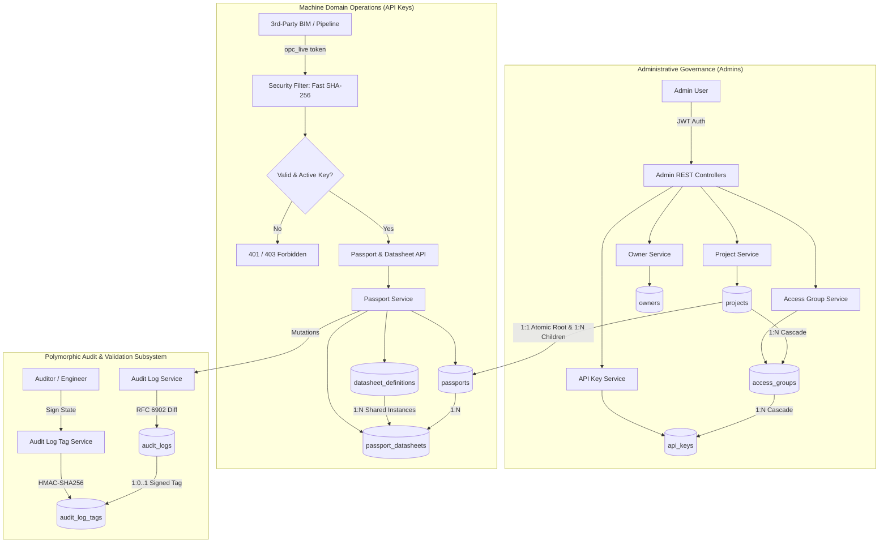

# Requirements

### Overview & Goals
The objective is to implement the target architecture for the **OpenCirc Passport Manager** as specified in `59-new-data-model.md`, `CONTEXT.md`, and Architecture Decision Records `docs/adr/0001` through `0009`. This transformation establishes strict administrative boundaries, multi-project isolation, granular machine API access delegation, normalized global datasheet definitions (PR #59), dual-layer soft archiving, and polymorphic audit logging with RFC 6902 JSON patch diffs and HMAC-SHA256 validation signatures.

### Scope

#### In Scope
- **Identity & Governance**: Rename `users` to `admins`, eliminate user roles, introduce `owners` (1:N to projects), and create `projects` with optional owner links.
- **Access Delegation**: Introduce `access_groups` defining JSONB CRUD permissions (`canCreate`, `canRead`, `canUpdate`, `canDelete`), and issue machine `api_keys` scoped under access groups.
- **High-Performance API Key Auth**: Structure API keys with public prefix `opc_live_<key_id>_<secret>` for $O(1)$ indexed lookup and constant-time SHA-256 verification (<0.05ms), with soft revocation (`status = 'REVOKED'`).
- **Direct Project Scoping & Atomic Provisioning**: Place `project_id` directly on `passports` (`ON DELETE CASCADE`), enforce 1:1 project-to-root invariant via PostgreSQL partial unique index `(project_id) WHERE parent_id IS NULL`, and provision root passports atomically during project creation (`POST /api/projects`).
- **Normalized Global Datasheets (PR #59)**: Split datasheets into immutable shared catalog (`datasheet_definitions` + `datasheet_definition_properties`) and per-passport instance records (`passport_datasheets`), eliminating data duplication and external API ingestion latency.
- **Dual-Layer Soft Archiving**: Enforce service-level soft archiving for projects and passports (`status = 'ARCHIVED'`, `archived_time = NOW()`), while retaining DDL cascades for clean automated test teardowns.
- **Polymorphic Audit Logging & Signed Validations**: Refactor `passport_logs` into `audit_logs` tracking mutations across passports, datasheets, and definitions using RFC 6902 JSON Patch arrays, with denormalized `project_id` and `passport_id` indexes. Add `audit_log_tags` supporting state transitions (`PENDING`, `APPROVED`, `REJECTED`) with HMAC-SHA256 signatures over canonical payload `log_id:target_id:email:tag:sha256(diff)`.
- **Pruning**: Delete obsolete `passport_templates` and `passport_lifecycles`.

#### Out of Scope
- Multi-tenant client self-service user login (owners intentionally remain simple organizational records without linked user accounts).
- Modifying external platform APIs (bSDD, Lexicon); external dictionary data models remain intact.

### User Stories
- **As a System Administrator**, I want to manage projects, owners, and access groups, so that I can configure system infrastructure without touching or corrupting circular material domain data.
- **As a System Administrator**, I want project creation to atomically generate the root passport anchor, so that no project ever exists in a half-configured or orphaned state.
- **As a Third-Party Integrator (BIM/CAD pipeline)**, I want to authenticate via high-speed API keys and ingest material passports, so that high-frequency bulk exports execute with minimal latency.
- **As a Third-Party Integrator**, I want standard building classifications (e.g., `IfcWall`) to resolve instantly from local cached definitions, so that redundant external HTTP calls are eliminated.
- **As a Material Auditor / Compliance Engineer**, I want to review RFC 6902 diffs and sign off on passport states using an HMAC-SHA256 signature, so that my validation is tamper-evident and legally non-repudiable under circular economy mandates.
- **As a System Administrator**, I want project deletion in production to perform soft archiving, so that decades of permanent environmental and material records are never wiped by accidental deletion.

### Functional Requirements
1. **Administrative Operations**:
   - `POST /api/admin/owners`, `GET /api/admin/owners`, `PUT /api/admin/owners/{id}`, `DELETE /api/admin/owners/{id}` (sets `projects.owner_id = NULL`).
   - `POST /api/admin/projects` (atomically creates `projects` and root `passports` row with `parent_id = NULL`, `created_by_id = NULL`).
   - `GET /api/admin/projects` (defaults to active; supports `?include_archived=true`).
   - `DELETE /api/admin/projects/{id}` (soft-archives project and cascades `status = 'ARCHIVED'` to passports).
   - `POST /api/admin/projects/{id}/restore` (restores project and root passport to `ACTIVE`).
   - `POST /api/admin/projects/{projectId}/access-groups`, `PUT /api/admin/projects/{projectId}/access-groups/{id}` (configures JSONB permissions).
   - `POST /api/admin/access-groups/{groupId}/api-keys` (returns generated key token once: `opc_live_<key_id>_<secret>`).
   - `POST /api/admin/api-keys/{id}/revoke` (sets `status = 'REVOKED'`).
2. **Machine Passport Operations**:
   - Machine requests authenticate via `Authorization: Bearer opc_live_<key_id>_<secret>` or `X-API-KEY`.
   - Child passport creation (`POST /api/passport/...`) requires authenticated API key and valid parent passport within the key's project.
   - Operations verify access group CRUD permissions (`canCreate`, `canRead`, `canUpdate`, `canDelete`) and enforce $O(1)$ project boundaries (`passport.project_id == apiKey.projectId`).
   - Default query filters exclude records where `status = 'ARCHIVED'`.
3. **Datasheet Operations**:
   - Adding a classification to a passport checks `datasheet_definitions` by `platform_id`. If cached, reuses it locally; if new, fetches from platform adapter, persists definition and properties, and creates instance in `passport_datasheets`.
   - Concurrency race conditions on `datasheet_definitions.platform_id` unique constraint are caught and handled by falling back to the existing record.
4. **Audit Logging & Verification**:
   - Every mutation to `passports`, `passport_datasheets`, or `datasheet_definitions` generates an `audit_logs` record containing the RFC 6902 JSON Patch diff array and denormalized `project_id` / `passport_id`.
   - `POST /api/audit-logs/{logId}/tags` creates or updates a validation tag (`PENDING`, `APPROVED`, `REJECTED`) with validator `email` and HMAC-SHA256 `signature`.
   - `GET /api/audit-logs/{logId}/tag/verify` evaluates the signature against canonical string `log_id:target_id:email:tag:sha256(diff)` and returns signature validity boolean.
   - `GET /api/audit-logs/project/{projectId}` and `GET /api/audit-logs/passport/{passportId}` return chronological audit streams in $O(1)$ time.

### Non-Functional Requirements
- **Authentication Latency**: API key lookup and constant-time SHA-256 verification must execute in <0.05ms per request.
- **Referential Integrity**: Zero database-level deletion deadlocks. Project cascades in test environments must execute cleanly without `ON DELETE RESTRICT` violations.
- **Tamper Evidence**: Cryptographic signatures must mathematically invalidate upon any modification to the diff payload, validator email, or tag status.
- **Backward Compatibility**: REST response shapes for `PassportDto` and `DatasheetDto` remain compatible with existing API consumers.

# Technical Design

### Current Implementation
- **Authentication**: `User.java` with enum `Role` (`ADMIN`, `USER`). `JwtFilter` validates JWT from cookies or BCrypt-hashed API keys via `X-API-KEY` and `X-API-SECRET` headers, loading `UserPrincipal` via `AuthUserDetailsService`.
- **Passports**: `Passport.java` has `parent_id` and embedded JSONB `createdBy`, but lacks `project_id`, `status` lifecycle enums (`ARCHIVED`), and direct access controls.
- **Datasheets**: Legacy 3-table model (`datasheets`, `datasheet_properties`, `passport_datasheet_mappings`) creates redundant copies per passport. PR #59 exists in branch `feat/global-datasheet-definitions` but is not merged.
- **Audit Logging**: `PassportLog.java` tracks coarse action events for passports only; no diffing, no multi-entity support, no validation tags.
- **Templates & Lifecycles**: `PassportTemplate` and `PassportLifecycle` exist as dead weight.
- **Migrations**: `V1` to `V6` exist in `src/main/resources/db/migration`.

### Key Decisions (ADRs 0001–0009)
1. **Administrative Boundary (ADR 0001)**: Rename `users` to `admins`, remove `role`. Admins manage infrastructure; machines perform domain operations.
2. **Direct Project Scoping on Passports (ADR 0002)**: Store `project_id` on `passports` (`ON DELETE CASCADE`), enforce 1:1 root passport via PostgreSQL partial unique index `(project_id) WHERE parent_id IS NULL`. Eliminates recursive CTEs.
3. **Atomic Root Provisioning (ADR 0003)**: Provision project and root passport atomically in one database transaction (`POST /api/projects`). Eliminates synthetic bootstrap API keys.
4. **Normalized Global Datasheets (ADR 0004 / PR #59)**: Split into shared `datasheet_definitions` + `datasheet_definition_properties` and per-passport `passport_datasheets`.
5. **High-Performance API Keys (ADR 0005)**: Format `opc_live_<key_id>_<secret>`, $O(1)$ indexed lookup, constant-time SHA-256 verification (<0.05ms), soft revocation (`status = 'REVOKED'`).
6. **Polymorphic Audit Logs with RFC 6902 Patch (ADR 0006)**: Track `passports`, `passport_datasheets`, `datasheet_definitions` with RFC 6902 diffs. Add `audit_log_tags` with HMAC-SHA256 signatures over canonical string `log_id:target_id:email:tag:sha256(diff)`.
7. **Prune Templates and Lifecycles (ADR 0007)**: Remove `passport_templates` and `passport_lifecycles`.
8. **Dual-Layer Soft Archiving (ADR 0008)**: Production soft archiving (`status = 'ARCHIVED'`, `archived_time`) with DDL `ON DELETE CASCADE` preserved for automated testing.
9. **Independent Organizational Owners (ADR 0009)**: `owners` table with optional `1:N` link to `projects` (`ON DELETE SET NULL`).

### Architecture Diagram



### Proposed Changes

#### 1. Database Migrations (`src/main/resources/db/migration/`)
- `V7__prune_templates_and_lifecycles.sql`: Drop `passport_templates`, `passport_lifecycles`.
- `V8__global_datasheet_definitions.sql`: Drop legacy datasheet tables; create `datasheet_definitions`, `datasheet_definition_properties`, `passport_datasheets`.
- `V9__admins_and_project_access_hierarchy.sql`: Rename `users` to `admins`, drop `role`; create `owners`, `projects`, `access_groups`; refactor `api_keys` and `passports` (add `project_id`, root partial unique index, drop `created_by` JSONB).
- `V10__audit_logs_and_signed_validation_tags.sql`: Drop `passport_logs`; create `audit_logs` and `audit_log_tags` with denormalized indexes.

#### 2. Models & Entities (`com.opencirc.api.passport.model`)
- Rename `User.java` to `Admin.java` (`@Table(name = "admins")`).
- Create `Owner.java`, `Project.java` (with `ProjectStatus`), `AccessGroup.java`.
- Refactor `ApiKey.java` (fields: `id`, `accessGroupId`, `secretHash`, `name`, `status`, `expirationTime`).
- Refactor `Passport.java` (fields: `projectId`, `Status status`, `archivedTime`, `createdById`, remove `createdBy` JSONB).
- Add `DatasheetDefinition.java`, `DatasheetDefinitionProperty.java`.
- Refactor `Datasheet.java` (`@Table(name = "passport_datasheets")`).
- Create `AuditLog.java` (`AuditTargetType`, `AuditAction`, `diff` JSONB) and `AuditLogTag.java` (`ValidationTag`, `email`, `signature`).
- Delete `PassportTemplate.java`, `PassportLifecycle.java`, `PassportDatasheetMapping.java`, `DatasheetProperty.java`, `PassportLog.java`.

#### 3. Security & Filter Layer (`com.opencirc.api.passport.config` & `auth`)
- Refactor `JwtFilter.java`:
  - Detect API key bearer format `opc_live_<key_id>_<secret>`.
  - Lookup by `id` ($O(1)$ indexed), verify `SHA256(secret) == apiKey.secretHash` using `MessageDigest.isEqual`.
  - Verify `apiKey.status == ACTIVE` and not expired.
  - Set `ApiKeyPrincipal` with `projectId`, `accessGroupId`, and permissions.
  - Retain JWT admin authentication for web console.
- Add `PermissionEvaluator` / interceptor enforcing access group permissions and matching `passport.projectId == apiKey.projectId`.

#### 4. Service Layer (`com.opencirc.api.passport.service`)
- `OwnerService`: CRUD owners.
- `ProjectService`:
  - `createProject`: inserts `Project` and root `Passport` (`parent_id = NULL`, `project_id = project.id`, `created_by_id = NULL`) in same `@Transactional` method.
  - `archiveProject`: sets `status = ARCHIVED`, `archived_time = OffsetDateTime.now()`, updates all project passports to `ARCHIVED`.
  - `restoreProject`: sets `status = ACTIVE`.
- `AccessGroupService`: CRUD access groups and permissions.
- `ApiKeyService`: token generator (`opc_live_<id>_<secret>`), SHA-256 hasher, soft revocation.
- `PassportService`: PR #59 integration (definition reuse), project scoping, machine creation, soft archiving.
- `JsonDiffService`: calculates RFC 6902 JSON patch operations between object versions.
- `SignatureService`: calculates and validates HMAC-SHA256 hex signatures.
- `AuditLogService` & `AuditLogTagService`: logs mutation diffs, manages signed tags.

### Data Models / Contracts

#### Project Creation Payload (`POST /api/admin/projects`)
```json
{
  "name": "EcoOffice Building B",
  "description": "Commercial circular office complex",
  "ownerId": "owner-uuid-optional"
}
```

#### Access Group Creation Payload (`POST /api/admin/projects/{projectId}/access-groups`)
```json
{
  "name": "BIM Pipeline Integrator",
  "description": "Automated Revit material passport exporter",
  "permissions": {
    "canCreate": true,
    "canRead": true,
    "canUpdate": true,
    "canDelete": false
  }
}
```

#### Generated API Key Response (`POST /api/admin/access-groups/{groupId}/api-keys`)
```json
{
  "id": "k8f9a2b1",
  "token": "opc_live_k8f9a2b1_c7e3f9a14d5e2b0...",
  "name": "Revit Production Pipeline",
  "status": "ACTIVE",
  "expirationTime": "2027-12-31T23:59:59Z"
}
```

#### Audit Log Validation Tag Payload (`POST /api/audit-logs/{logId}/tags`)
```json
{
  "tag": "APPROVED",
  "email": "lead.auditor@certifier.org"
}
```

#### Canonical Signature Formula
```text
canonical = log_id + ":" + target_id + ":" + email + ":" + tag + ":" + sha256(diff_json)
signature = hex(HMAC_SHA256(api_key_secret, canonical))
```

### File Structure Changes

#### Files Added
- `src/main/resources/db/migration/V7__prune_templates_and_lifecycles.sql`
- `src/main/resources/db/migration/V8__global_datasheet_definitions.sql`
- `src/main/resources/db/migration/V9__admins_and_project_access_hierarchy.sql`
- `src/main/resources/db/migration/V10__audit_logs_and_signed_validation_tags.sql`
- `src/main/java/com/opencirc/api/passport/model/Admin.java`
- `src/main/java/com/opencirc/api/passport/model/Owner.java`
- `src/main/java/com/opencirc/api/passport/model/Project.java`
- `src/main/java/com/opencirc/api/passport/model/AccessGroup.java`
- `src/main/java/com/opencirc/api/passport/model/DatasheetDefinition.java`
- `src/main/java/com/opencirc/api/passport/model/DatasheetDefinitionProperty.java`
- `src/main/java/com/opencirc/api/passport/model/AuditLog.java`
- `src/main/java/com/opencirc/api/passport/model/AuditLogTag.java`
- Repositories, DTOs, Services, and Controllers for Admin, Owner, Project, AccessGroup, AuditLog, and AuditLogTag.
- `src/main/java/com/opencirc/api/passport/service/JsonDiffService.java`
- `src/main/java/com/opencirc/api/passport/service/SignatureService.java`

#### Files Modified
- `pom.xml`: Add JSON patch library if necessary.
- `src/main/java/com/opencirc/api/passport/model/Passport.java`
- `src/main/java/com/opencirc/api/passport/model/Datasheet.java`
- `src/main/java/com/opencirc/api/passport/model/ApiKey.java`
- `src/main/java/com/opencirc/api/passport/config/JwtFilter.java`
- `src/main/java/com/opencirc/api/passport/config/SecurityConfig.java`
- `src/main/java/com/opencirc/api/passport/service/PassportService.java`
- `src/main/java/com/opencirc/api/passport/controller/PassportController.java`
- Shell commands and seeders.

#### Files Deleted
- `User.java`, `UserRepository.java`, `UserPrincipal.java` (renamed to Admin equivalents).
- `PassportTemplate.java`, `PassportTemplateRepository.java`, `PassportTemplateService.java`, `PassportTemplateController.java`.
- `PassportLifecycle.java`.
- `PassportDatasheetMapping.java`, `DatasheetProperty.java`.
- `PassportLog.java`, `PassportLogRepository.java`, `PassportLogService.java`, `PassportLogController.java` (replaced by AuditLog equivalents).

### Risks & Mitigations
- **Concurrent Definition Insertions**: Parallel ingestion of identical bSDD classes could trigger race conditions on `platform_id` unique constraint.  
  *Mitigation*: Wrap definition persisting in a try-catch for `DataIntegrityViolationException`, reloading the persisted definition from the competing transaction.
- **Accidental Hard Deletes**: Direct SQL `DELETE` calls could wipe permanent compliance records.  
  *Mitigation*: Production service endpoints only set `status = 'ARCHIVED'`. Database cascades are preserved strictly for automated test isolation.
- **API Key Secret Disclosure**: Exposing raw keys risks authorization breaches.  
  *Mitigation*: The raw key is returned exactly once during generation (`GeneratedApiKeyDto`); only SHA-256 hash is persisted in `api_keys.secret_hash`.

# Testing

### Validation Approach
Verification combines database migration tests, unit tests for authentication and cryptographic primitives, mock-based integration tests for services, and end-to-end REST API tests covering both administrative and machine flows.

### Key Scenarios

#### 1. Database Migration & Schema Verification
- Flyway migrations `V7` through `V10` apply cleanly on an initialized PostgreSQL instance.
- Check table existence, column types, foreign key actions (`ON DELETE CASCADE` vs `SET NULL`), and indexes (specifically partial unique index `(project_id) WHERE parent_id IS NULL`).
- Validate that `passport_templates` and `passport_lifecycles` are completely dropped.

#### 2. Authentication & High-Performance Key Resolution
- **Admin JWT**: Admin logs in with email/password, receives JWT cookies, and accesses `/api/admin/**` endpoints. Non-admins cannot access admin endpoints.
- **Machine API Key**:
  - Issue API key formatted `opc_live_<key_id>_<secret>`.
  - Send request with valid bearer token: instant $O(1)$ key lookup and constant-time SHA-256 hash match succeeds in <0.05ms.
  - Send request with invalid secret: rejected with 401 Unauthorized.
  - Revoke key (`status = 'REVOKED'`): immediate rejection with 401 Unauthorized.
  - Expired key: immediate rejection with 401 Unauthorized.

#### 3. Atomic Project Provisioning & Soft Archiving
- `POST /api/admin/projects`: verify in one transaction that the project is created AND a root passport is inserted with `parent_id = NULL`, `project_id = project.id`, `created_by_id = NULL`.
- Attempting to manually insert a second passport with `parent_id = NULL` for the same `project_id` fails with PostgreSQL unique constraint violation.
- `DELETE /api/admin/projects/{id}`: verify project status becomes `ARCHIVED`, `archived_time` is set, and all child passports are updated to `status = 'ARCHIVED'`.
- Default query `GET /api/admin/projects` excludes the archived project; `?include_archived=true` returns it.

#### 4. Normalized Datasheet Definition Reuse (PR #59)
- Ingest a passport with bSDD classification URI: creates `datasheet_definitions`, `datasheet_definition_properties`, and `passport_datasheets`.
- Ingest a second passport with the same classification URI: reuses the existing definition row; external platform adapter is NOT called; zero duplicate rows created in `datasheet_definitions`.
- Concurrency test: simulate two threads ingesting the same URI simultaneously; verify conflict resolution without 500 error.

#### 5. RFC 6902 JSON Patch & Cryptographic Signatures
- Mutate a passport property: verify `audit_logs` record is created containing RFC 6902 patch (e.g. `[{"op": "replace", "path": "/data/fireRating", "value": "EI60"}]`).
- Query project activity feed `GET /api/audit-logs/project/{projectId}`: returns log entries via indexed `project_id` without joining passports.
- Attach validation tag `POST /api/audit-logs/{logId}/tags`: calculates HMAC-SHA256 signature using the active API key secret and canonical string.
- Call `GET /api/audit-logs/{logId}/tag/verify`: returns `valid: true`.
- Tamper with the diff JSON in the database and re-verify: returns `valid: false`.

### Edge Cases
- **Subtree Reparenting**: Reparenting a child passport within the same project maintains `project_id`. Attempting to reparent across projects requires updating `project_id` and is blocked if the caller lacks authorization on the target project.
- **Owner Deletion**: Deleting an owner organization sets `projects.owner_id = NULL` without deleting or modifying any project, passport, or access group.
- **Missing Root Passport Invariant**: Ensuring no endpoint allows deleting only the root passport while the project remains active.

### Test Changes
- **Update Existing Tests**:
  - `TestPassportController.java`: update to supply project and API key credentials.
  - `TestPassportService.java`: update for `project_id` scoping and direct `Set<Datasheet>`.
  - `TestAuthController.java`: update for Admin login without role.
- **Add New Tests**:
  - `TestFastApiKeyAuthentication.java`: benchmarking and verifying constant-time SHA-256 API key lookups and soft revocation.
  - `TestProjectAtomicProvisioningAndArchiving.java`: verifying atomic root creation, cascade soft archiving, and query exclusions.
  - `TestDatasheetDefinitionReuse.java`: incorporating PR #59 reuse and concurrency test.
  - `TestAuditLogPatchAndSignature.java`: verifying RFC 6902 diff generation, canonical HMAC signature generation, and tamper detection.
- **Delete Obsolete Tests**:
  - `TestPassportTemplateController.java`
  - Any obsolete lifecycle tests.

# Delivery Steps

###   Step 1: Prune Legacy Subsystems & Establish Database Schema Migrations
All obsolete tables and legacy mappings are eliminated from the database, and the target relational schema is established via forward-only Flyway migrations.

- Add Flyway migration `V7__prune_templates_and_lifecycles.sql` dropping `passport_templates` and `passport_lifecycles` (ADR 0007).
- Add Flyway migration `V8__global_datasheet_definitions.sql` integrating PR #59: drop legacy `passport_datasheet_mappings`, `datasheet_properties`, and `datasheets`, and create `datasheet_definitions`, `datasheet_definition_properties`, and `passport_datasheets` with uniqueness constraints on `platform_id` and `(passport_id, definition_id)` (ADR 0004).
- Add Flyway migration `V9__admins_and_project_access_hierarchy.sql`:
  - Rename `users` to `admins` and drop the obsolete `role` column (ADR 0001).
  - Create `owners` table (`id`, `name`, `created_time`) (ADR 0009).
  - Create `projects` table (`id`, `owner_id` FK ON DELETE SET NULL, `name`, `description`, `status`, `created_by_id`, `created_by` JSONB, `created_time`, `archived_time`).
  - Create `access_groups` table (`id`, `project_id` FK ON DELETE CASCADE, `name`, `description`, `permissions` JSONB, `created_by_id`, `created_by` JSONB, `created_time`).
  - Refactor `api_keys` table: drop `user_id` and `secret`, add `access_group_id` FK ON DELETE CASCADE, `secret_hash` TEXT, `status` VARCHAR(20) ('ACTIVE', 'REVOKED') (ADR 0005).
  - Alter `passports`: add `project_id` FK ON DELETE CASCADE, `status` ('ACTIVE', 'INACTIVE', 'ARCHIVED'), `archived_time`, re-link `created_by_id` to `api_keys(id)` ON DELETE SET NULL, drop redundant `created_by` JSONB snapshot, and create partial unique index `uq_project_root_passport` on `(project_id) WHERE parent_id IS NULL` (ADR 0002, ADR 0008).
- Add Flyway migration `V10__audit_logs_and_signed_validation_tags.sql`:
  - Drop legacy `passport_logs`.
  - Create `audit_logs` table (`id`, `target_type`, `target_id`, `project_id` FK, `passport_id` FK, `action`, `diff` JSONB, `created_by_id` FK -> `api_keys(id)`, `created_time`) with composite indexes on `(target_type, target_id, created_time ASC)`, `(project_id, created_time DESC)`, and `(passport_id, created_time DESC)` (ADR 0006).
  - Create `audit_log_tags` table (`id`, `log_id` FK UNIQUE ON DELETE CASCADE, `tag`, `email`, `api_key_id` FK -> `api_keys(id)` ON DELETE RESTRICT, `signature`, `created_time`, `updated_time`) with indexes on `email` and `tag`.
- Validate migration execution against local PostgreSQL container with automated Flyway migration test.

###   Step 2: Implement Admin Governance, Project Lifecycles & High-Throughput API Key Authentication
Admins can manage owners, projects, access groups, and API keys with atomic root passport provisioning, soft archiving, and sub-0.05ms SHA-256 API key authentication.

- Refactor `User.java` to `Admin.java` (`@Table(name = "admins")`), remove `Role`, and update `UserRepository` to `AdminRepository`, `UserPrincipal` to `AdminPrincipal`, and `AuthUserDetailsService` to `AdminDetailsService`.
- Create JPA entities and repositories: `Owner`, `OwnerRepository`, `Project`, `ProjectRepository`, `AccessGroup`, `AccessGroupRepository`, and refactor `ApiKey`, `ApiKeyRepository`.
- Implement `OwnerService` and `OwnerController` (`/api/admin/owners`) for organizational CRUD.
- Implement `ProjectService` and `ProjectController` (`/api/admin/projects`):
  - In `createProject`, atomically provision both `projects` row and root `passports` row (`parent_id = NULL`, `project_id = project.id`, `created_by_id = NULL`) in a single database transaction (ADR 0003).
  - In `archiveProject` (soft delete), set `status = 'ARCHIVED'`, `archived_time = NOW()`, and propagate soft archiving to all child passports: `UPDATE passports SET status = 'ARCHIVED', archived_time = NOW() WHERE project_id = ?` (ADR 0008).
  - Support `restoreProject` (`status = 'ACTIVE'`) and default exclusion of archived projects in queries (`WHERE status != 'ARCHIVED'`).
- Implement `AccessGroupService` and `AccessGroupController` (`/api/admin/projects/{projectId}/access-groups`) managing JSONB CRUD permissions (`canCreate`, `canRead`, `canUpdate`, `canDelete`).
- Refactor `ApiKeyService` and `ApiKeyController` (`/api/admin/access-groups/{groupId}/api-keys`):
  - Generate tokens with prefix format `opc_live_<key_id>_<secret>`, store constant-time SHA-256 `secret_hash`, and return raw token once via `GeneratedApiKeyDto`.
  - Implement soft revocation (`status = 'REVOKED'`).
- Refactor `JwtFilter.java` and `SecurityConfig.java`:
  - For machine requests, extract `<key_id>`, perform $O(1)$ indexed lookup, compute constant-time SHA-256 verification against `secret_hash`, check `status == 'ACTIVE'`, and populate `ApiKeyPrincipal` with project ID and access group permissions.
  - Implement permission enforcement interceptor/aspect checking `accessGroup.permissions` against HTTP method and target project.
- Write unit and slice tests for JWT admin login, fast SHA-256 API key verification, atomic project provisioning, and soft archiving.

###   Step 3: Integrate Normalized Global Datasheets & Scoped Passport Operations
Passports are strictly scoped to projects, child creation is restricted to machine API keys, and external classifications reuse global definitions without duplication.

- Integrate PR #59 entity models: `DatasheetDefinition.java`, `DatasheetDefinitionProperty.java`, and refactor `Datasheet.java` (`@Table(name = "passport_datasheets")`), deleting `PassportDatasheetMapping.java` and legacy `DatasheetProperty.java`.
- Update `DatasheetDefinitionRepository`, `DatasheetDefinitionPropertyRepository`, and `DatasheetRepository`.
- Update `Passport.java`:
  - Add `projectId`, `Status status` (`ACTIVE`, `INACTIVE`, `ARCHIVED`), `archivedTime`, `createdById` (FK to `api_keys(id)`), remove `createdBy` JSONB snapshot.
  - Set `@OneToMany Set<Datasheet> datasheets` pointing directly to `passport_datasheets`.
- Update `PassportRepository`:
  - Add queries filtering out archived records by default (`WHERE status != 'ARCHIVED'`).
  - Add `findByProjectId(String projectId)` and `findByProjectIdAndParentIdIsNull(String projectId)`.
- Refactor `PassportService.java`:
  - Enforce machine `ApiKeyPrincipal` context for child passport creation (`parent_id != null`) and datasheet attachment/update.
  - Enforce $O(1)$ project authorization: verify `passport.projectId == apiKeyPrincipal.projectId`.
  - Integrate global definition resolution and caching (`resolveDefinitions`) with duplicate catch handling on `platformId` unique constraint.
  - Implement passport soft archiving (`archivePassport`) cascading status `ARCHIVED` down the assembly subtree.
- Update `PassportController.java` to reflect project boundaries, machine authentication, and `?include_archived=true` query filter support.
- Delete `PassportTemplate.java`, `PassportTemplateRepository`, `PassportTemplateService`, and `PassportTemplateController`.
- Write unit and integration tests verifying global definition caching, concurrent definition ingestion safety, child passport creation scoping, and subtree soft archiving.

###   Step 4: Implement Polymorphic Audit Logging with RFC 6902 JSON Patch & Signed Validation Tags
Every mutation across passports, datasheets, and definitions is tracked as an RFC 6902 JSON patch, and states can be signed with HMAC-SHA256 validation tags.

- Add `zjsonpatch` / Jackson JSON patch dependency to `pom.xml` if needed, and create `JsonDiffService.java` to compute RFC 6902 JSON Patch arrays between previous and new entity states.
- Create JPA entities: `AuditLog.java` (`@Table(name = "audit_logs")`) with `AuditTargetType` (`PASSPORT`, `PASSPORT_DATASHEET`, `DATASHEET_DEFINITION`), `AuditAction` (`CREATE`, `UPDATE`, `DELETE`), and `AuditLogTag.java` (`@Table(name = "audit_log_tags")`) with `ValidationTag` (`PENDING`, `APPROVED`, `REJECTED`).
- Create `AuditLogRepository` and `AuditLogTagRepository`.
- Implement `SignatureService.java` providing cryptographic signature generation and verification:
  - Canonical payload format: `log_id + ":" + target_id + ":" + email + ":" + tag + ":" + sha256(diff_json)`.
  - Signature algorithm: `HmacSHA256` keyed by the API key secret.
- Implement `AuditLogService.java`:
  - Hook into `PassportService` and datasheet operations to asynchronously or transactionally persist polymorphic audit logs with JSON patch diffs and denormalized `project_id` and `passport_id`.
  - Provide $O(1)$ indexed query methods: `findByTarget`, `findByProjectId` (zero-join project activity feed), `findByPassportId`.
- Implement `AuditLogTagService.java`:
  - Attach/transition validation tag for a log entry (`log_id` UNIQUE).
  - Verify HMAC-SHA256 signature using the signing API key secret and canonical payload.
- Refactor `PassportLogController.java` to `AuditLogController.java` with routes for target logs, project-wide logs, passport logs, tag assignment, and signature verification.
- Delete legacy `PassportLog.java`, `PassportLogRepository`, and `PassportLogService`.
- Write tests verifying RFC 6902 diff generation, canonical HMAC signature generation, tamper detection (tampering diff or email fails verification), and project-wide query performance.

###   Step 5: Update Shell Commands, Seeders & System Integration Testing
All CLI commands and database seeders match the target architecture, and the system passes end-to-end integration and security test suites.

- Refactor Spring Shell commands:
  - Update `ApiKeyCommand.java` to support creating and revoking API keys under access groups with prefixed token output.
  - Rename `UserCommand.java` to `AdminCommand.java` for managing administrative accounts.
  - Add `ProjectCommand.java` for administrative project provisioning, archiving, and access group setup.
  - Update `PassportCommand.java` to require project context and machine credentials.
- Update seeders:
  - Update `UserSeeder.java` to `AdminSeeder.java` to seed default administrators into `admins`.
  - Update `PassportFromJsonSeeder.java` and `PassportFromApiSeeder.java` to seed project, access group, and API key infrastructure before creating child passports and attaching datasheets.
- Update OpenAPI/Swagger documentation (`RestConfig.java`, annotations on all controllers) reflecting administrative vs machine endpoint separation.
- Implement end-to-end integration test suite:
  - Complete lifecycle test: Admin login -> Create Project & atomic root passport -> Create Access Group & API Key -> Machine authenticated child passport creation -> Attach global datasheet -> Modify properties & verify RFC 6902 audit diff -> Sign audit log with HMAC-SHA256 -> Verify signature -> Soft archive project and verify cascade.
  - Negative security tests: revoked API key rejection, cross-project passport mutation rejection ($O(1)$ boundary check), unauthenticated admin endpoint rejection.